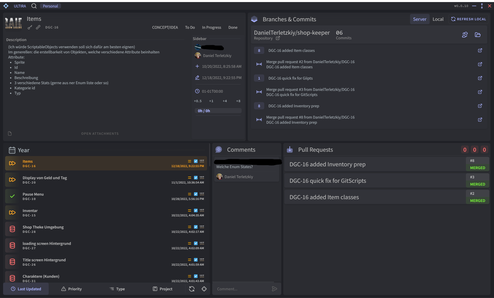
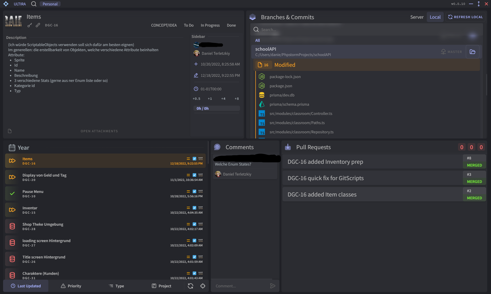
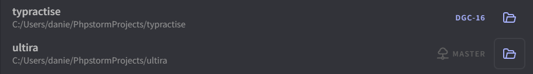
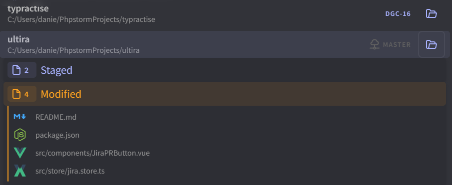
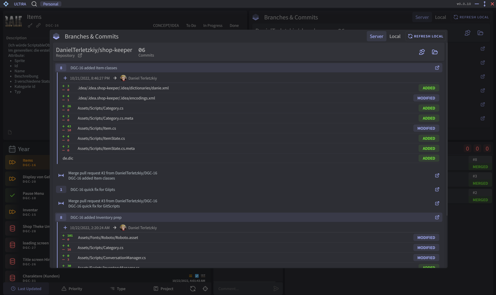

## About

Ultira is a dashboard tool designed to work with Jira (cloud and server) and with GitHub, Bitbucket and server-stash as
well
The layout is simple and easy to navigate with all the information you would need at a quick glance

With the help of electron and shellJs it gets the ability to scrape your directories for folders containing a .git
folder and store them in Ultira.
You can check the current branch of each project and open go to a Jira issue if a matching ticket number is within the
branch name.
When there is a Jira issue open, then you can switch a project to it with on press of a button, this will also shelve
uncommited changes (it will show that beforehand)




## How to start?

Development:
```npm run electron:start```

Package it up:
```npm run electron:dist```

Release it:
```npm run electron:release```

## How to configure?

1. Click the icon in the top left
2. Delete existing configuration with a double click
3. Create new Jira config with the "Add Config" button
4. Enter some name for your config (not important)
5. Enter the Jira server url, should look like this: https://your-domain.atlassian.net
6. Select your Git server. If you use and older version of Bitbucket you may need to use "Stash"
7. Double-click on save, then double-click on the key icon to enter your credentials
8. Once the credentials are submitted, the app should reload and you should see your tickets on the bottom left.
9. You are done!

You can now explore each of the 5 components on the dashboard.

## What are Local Projects and how to use them?

Ultira can not only help you with Jira and git on the server, but it can also manage your local projects that can be
tied with Jira!

If projects have been added in the settings, they will be updated via custom interval. In this update, the current
branch, default branch and git status will be scraped and sent back to the frontend.

In addition to setting projects, you can also define IDEs and bind them with projects individually. This can be used to
open project directories or files using the appropriate IDE

Projects can be added manually or by scraping a directory path (e.g `D:\projects\ `), it can take a minute or two
depending on the amount of files in this directory.
This method scans each directory for a .git directory.

### Using the project change button

With defined projects, you can ready-up or switch to an exising branch that has the ID of the currently selected
ticket (e.g `ABC-123`)

1. Under Branched & Commits you will see two tabs labeled "Server" and "Local" (default is Local if no Server data and
   vice
   versa) go to the "Local" tab
2. Search for the desired Project
3. Double-click on the open-folder icon-button, you will see that the tooltip updates with the status of the branch
   changing process
    1. Starts the shell
    2. Brings shell to project directory
    3. Creates or checks out branch with latest pull from projects default branch
        1. git.stash();
        2. git.checkout(defaultBranch);
        3. git.fetch();
        4. git.pull();
    4. Opens project using bound IDE

If the branch change icon button has an outline, that means that there are still changes that aren't committed
You can expand the project and look into the files and open them individually using you bound IDE



## Extra Features

### Search

Press `CTR` + `SHIFT` + `S` to open the search dialog,
there you can search for ticket summary, ticket key, etc

### Hide Dashboard components

Press on the left-side icons of each component to temporarily hide them

### Fullscreen Dashboard components

Long-click each of the components except the Ticket list, to open them in a large dialog window


### Quick Pull Request

Go to Branches & Commits > Server, then click on the "Create PR" button. You will be redirected to a page with all the
branch details already filled in
